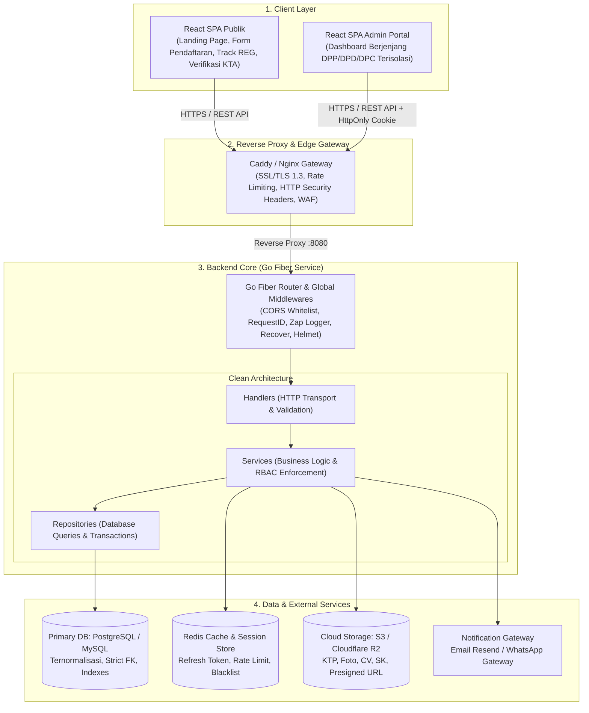
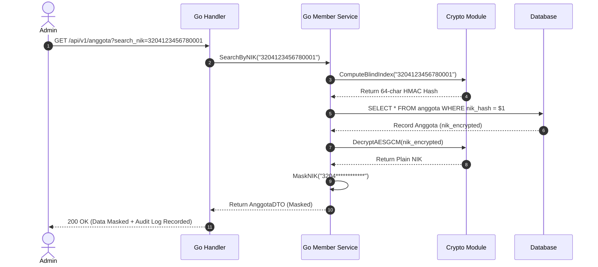
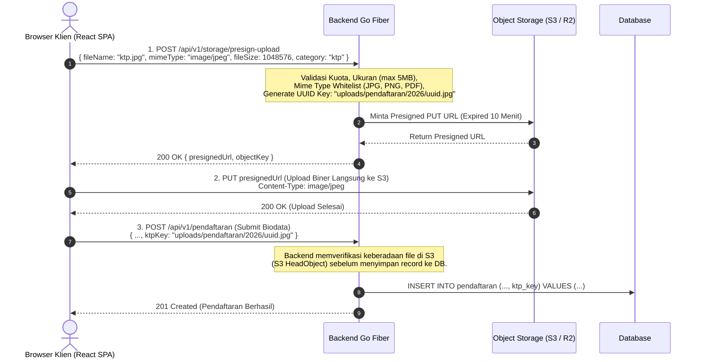
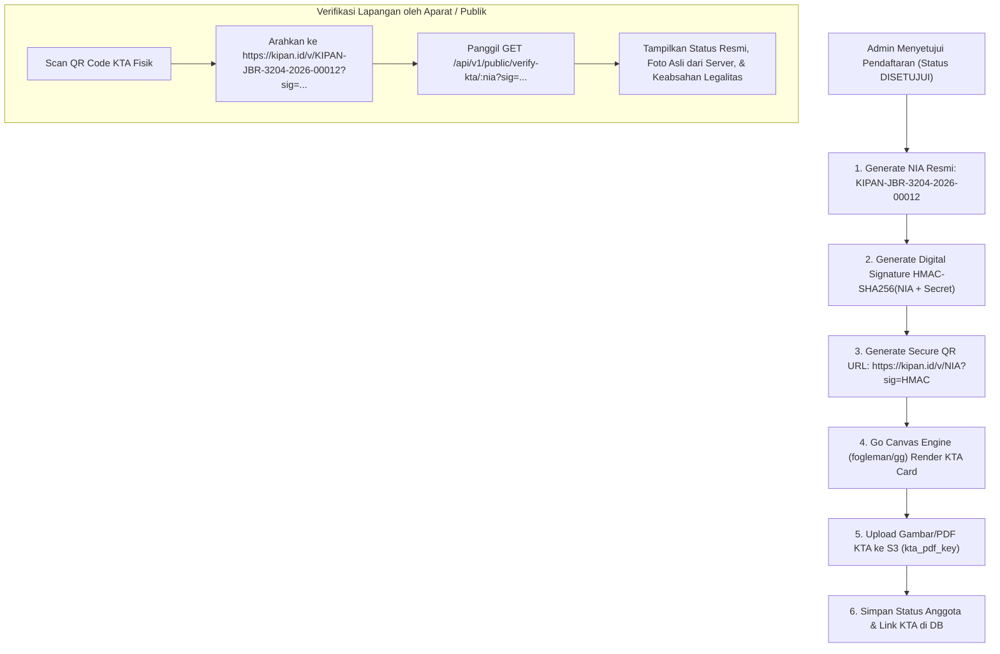

# 🏛️ CETAK BIRU & SPESIFIKASI TEKNIS REWRITE SISTEM KIPAN INDONESIA
## Migrasi dari Monolith TypeScript (Next.js) ke Go Fiber (Clean Architecture) & ReactJS SPA

> **Nomor Dokumen**: KIPAN-SPEC-MIGRATION-2026-V1  
> **Status Dokumen**: Approved Blueprint / Architecture Specification  
> **Klasifikasi Keamanan**: Restricted — Internal Engineering DPP KIPAN Indonesia  
> **Dasar Kepatuhan**: UU Perlindungan Data Pribadi (UU PDP No. 27/2022), OWASP Top 10 API Security 2023, RFC 7807, ISO/IEC 27001  
> **Tujuan**: Menggantikan arsitektur lama yang memiliki 42 celah keamanan dan skalabilitas fatal dengan sistem terdistribusi modern yang tangguh, aman, dan berkecepatan tinggi.

---

## DAFTAR ISI
1. [Ringkasan Eksekutif & Keputusan Arsitektur](#1-ringkasan-eksekutif--keputusan-arsitektur)
2. [Arsitektur Sistem Tingkat Tinggi (High-Level Architecture)](#2-arsitektur-sistem-tingkat-tinggi-high-level-architecture)
3. [Skema Database & DDL Baru (Mengatasi Ledakan Base64)](#3-skema-database--ddl-baru-mengatasi-ledakan-base64)
4. [Arsitektur Keamanan Data Pribadi (UU PDP & Kriptografi)](#4-arsitektur-keamanan-data-pribadi-uu-pdp--kriptografi)
5. [Autentikasi, Sesi & Matriks Otorisasi (RBAC Berjenjang)](#5-autentikasi-sesi--matriks-otorisasi-rbac-berjenjang)
6. [Arsitektur Storage & Alur Presigned Upload (S3 / Cloudflare R2)](#6-arsitektur-storage--alur-presigned-upload-s3--cloudflare-r2)
7. [Mesin Penerbitan KTA Server-Side & Verifikasi QR Code](#7-mesin-penerbitan-kta-server-side--verifikasi-qr-code)
8. [Kontrak Standar API & Katalog Endpoint REST](#8-kontrak-standar-api--katalog-endpoint-rest)
9. [Arsitektur Frontend ReactJS SPA (Isolasi Total Bundle Admin)](#9-arsitektur-frontend-reactjs-spa-isolasi-total-bundle-admin)
10. [Struktur Folder & Standar Kode Backend Go Fiber](#10-struktur-folder--standar-kode-backend-go-fiber)
11. [Rencana Langkah Kerja & Roadmap Eksekusi (Phase-by-Phase)](#11-rencana-langkah-kerja--roadmap-eksekusi-phase-by-phase)

---

## 1. RINGKASAN EKSEKUTIF & KEPUTUSAN ARSITEKTUR

### 1.1. Mengapa Migrasi ke Go Fiber + ReactJS SPA?
Sistem lama berbasis Next.js App Router menyatukan frontend publik, dashboard admin, dan API routes dalam satu proses runtime. Pendekatan ini menghasilkan kegagalan fatal:
1. **Bundle Admin Bocor**: Seluruh komponen admin diunduh ke browser publik (`Ctrl + Shift + A` membuka panel admin via bypass localStorage).
2. **Ketiadaan Server Auth**: Endpoint API tidak memiliki session middleware; otorisasi dibaca dari parameter URL/body klien.
3. **Database Bloat**: File diunggah sebagai string Base64 ke dalam kolom `LongText` MySQL (potensi 1 TB untuk 100 ribu anggota).
4. **Enkripsi Rusak**: AES Hardcoded key dan static IV yang melanggar UU PDP No. 27/2022.

### 1.2. Tabel Keputusan Teknologi Baru

| Komponen | Teknologi Lama | Teknologi Baru | Alasan & Justifikasi Teknis |
|:---|:---|:---|:---|
| **Backend Engine** | Next.js API Routes (Node.js) | **Go Fiber v2 / v3** | Kompilasi biner mandiri, konkurensi goroutine tinggi, konsumsi RAM < 50MB, *type-safety* ketat. |
| **Arsitektur Backend** | Route Handler Monolitik | **Clean / Layered Architecture** | Pemisahan tanggung jawab mutlak: `Handler -> Service -> Repository`. |
| **Frontend** | Next.js SSR/App Router Monolith | **ReactJS 19 + Vite (SPA)** | Pemisahan bundle total; bundle admin diproteksi di balik lazy loading & token route guard terisolasi. |
| **Database** | MySQL (Base64 LongText) | **PostgreSQL 16 / MySQL 8.0** | Skema relasional ternormalisasi; berkas dipindahkan ke Object Storage. |
| **File Storage** | Lokal Disk & MySQL LongText | **Cloud Object Storage (S3 / R2)** | Presigned URL direct upload; zero memory load pada thread backend. |
| **Caching & Session** | In-Memory (Tidak ada) | **Redis 7** | Stateful refresh token blacklist, sliding-window rate limiting, caching dashboard. |
| **Password Hashing** | Bcrypt (Cost default / lemah) | **Argon2id** (OWASP 2025) | Tahan terhadap GPU/ASIC brute-force attack. |
| **Enkripsi NIK** | AES-CBC static IV (Hardcoded) | **AES-256-GCM + Blind Index (HMAC)** | Random IV per NIK, verifikasi integritas data, dan Blind Index untuk pencarian cepat. |

---

## 2. ARSITEKTUR SISTEM TINGKAT TINGGI (HIGH-LEVEL ARCHITECTURE)



---

## 3. SKEMA DATABASE & DDL BARU (MENGATASI LEDAKAN BASE64)

### 3.1. Prinsip Desain Skema Baru
1. **Zero Base64**: Semua berkas fisik dipindahkan ke S3. Database hanya menyimpan `object_key` atau S3 URL.
2. **UU PDP Compliance**: NIK disimpan dalam bentuk terenkripsi (`nik_encrypted` menggunakan AES-256-GCM) dan kolom blind index (`nik_hash` menggunakan HMAC-SHA256).
3. **Integritas Audit (Fix Issue 34)**: Saat pendaftaran disetujui, baris data `pendaftaran` **TIDAK DIHAPUS**. Kolom `status` diubah menjadi `DISETUJUI` dan menautkan foreign key `anggota_id`.
4. **Soft Delete**: Tabel utama menggunakan `deleted_at TIMESTAMP NULL` untuk mencegah *cascading catastrophic delete* pada master wilayah atau SK.

### 3.2. DDL PostgreSQL / MySQL (Versi Standar ANSI SQL)

```sql
-- ============================================================
-- 1. TABEL MASTER WILAYAH & JABATAN
-- ============================================================

CREATE TABLE provinsi (
    id SERIAL PRIMARY KEY,
    kode VARCHAR(10) NOT NULL UNIQUE,
    nama VARCHAR(100) NOT NULL,
    status VARCHAR(20) NOT NULL DEFAULT 'Aktif', -- Aktif | Pembentukan
    created_at TIMESTAMP WITH TIME ZONE DEFAULT CURRENT_TIMESTAMP,
    updated_at TIMESTAMP WITH TIME ZONE DEFAULT CURRENT_TIMESTAMP,
    deleted_at TIMESTAMP WITH TIME ZONE NULL
);

CREATE TABLE kabupaten (
    id SERIAL PRIMARY KEY,
    provinsi_id INT NOT NULL REFERENCES provinsi(id) ON UPDATE CASCADE ON DELETE RESTRICT,
    kode VARCHAR(10) NOT NULL UNIQUE,
    nama VARCHAR(100) NOT NULL,
    status VARCHAR(20) NOT NULL DEFAULT 'Aktif',
    created_at TIMESTAMP WITH TIME ZONE DEFAULT CURRENT_TIMESTAMP,
    updated_at TIMESTAMP WITH TIME ZONE DEFAULT CURRENT_TIMESTAMP,
    deleted_at TIMESTAMP WITH TIME ZONE NULL
);
CREATE INDEX idx_kabupaten_provinsi ON kabupaten(provinsi_id);

CREATE TABLE jabatan (
    id SERIAL PRIMARY KEY,
    nama VARCHAR(100) NOT NULL,
    level VARCHAR(20) NOT NULL, -- NASIONAL | PROVINSI | KABUPATEN
    created_at TIMESTAMP WITH TIME ZONE DEFAULT CURRENT_TIMESTAMP,
    updated_at TIMESTAMP WITH TIME ZONE DEFAULT CURRENT_TIMESTAMP
);

-- ============================================================
-- 2. TABEL PENGGUNA SISTEM (USERS & RBAC)
-- ============================================================

CREATE TABLE users (
    id UUID PRIMARY KEY DEFAULT gen_random_uuid(),
    email VARCHAR(255) NOT NULL UNIQUE,
    password_hash VARCHAR(255) NOT NULL,
    name VARCHAR(150) NOT NULL,
    role VARCHAR(30) NOT NULL, -- SUPER_ADMIN | ADMIN_NASIONAL | ADMIN_PROVINSI | ADMIN_KABUPATEN
    status VARCHAR(20) NOT NULL DEFAULT 'Aktif', -- Aktif | Nonaktif | Suspended
    avatar_url VARCHAR(500) NULL,
    provinsi_id INT NULL REFERENCES provinsi(id) ON UPDATE CASCADE ON DELETE RESTRICT,
    kabupaten_id INT NULL REFERENCES kabupaten(id) ON UPDATE CASCADE ON DELETE RESTRICT,
    last_login_at TIMESTAMP WITH TIME ZONE NULL,
    created_at TIMESTAMP WITH TIME ZONE DEFAULT CURRENT_TIMESTAMP,
    updated_at TIMESTAMP WITH TIME ZONE DEFAULT CURRENT_TIMESTAMP,
    deleted_at TIMESTAMP WITH TIME ZONE NULL
);
CREATE INDEX idx_users_role ON users(role);
CREATE INDEX idx_users_wilayah ON users(provinsi_id, kabupaten_id);

-- Refresh Token Store (Stateful Token Rotation)
CREATE TABLE user_refresh_tokens (
    id UUID PRIMARY KEY DEFAULT gen_random_uuid(),
    user_id UUID NOT NULL REFERENCES users(id) ON DELETE CASCADE,
    token_hash CHAR(64) NOT NULL UNIQUE, -- SHA-256 hash of refresh token
    family_id UUID NOT NULL, -- Identifikasi keluarga token untuk deteksi reuse
    is_revoked BOOLEAN NOT NULL DEFAULT FALSE,
    expires_at TIMESTAMP WITH TIME ZONE NOT NULL,
    created_at TIMESTAMP WITH TIME ZONE DEFAULT CURRENT_TIMESTAMP
);
CREATE INDEX idx_refresh_token_lookup ON user_refresh_tokens(token_hash, is_revoked);

-- ============================================================
-- 3. TABEL PENDAFTARAN (CALON ANGGOTA)
-- ============================================================

CREATE TABLE pendaftaran (
    id SERIAL PRIMARY KEY,
    nomor_pendaftaran VARCHAR(30) NOT NULL UNIQUE, -- REG-YYYYMM-XXXX
    nama_lengkap VARCHAR(150) NOT NULL,
    nik_hash CHAR(64) NOT NULL, -- Blind Index HMAC-SHA256 untuk deteksi duplikasi & pencarian
    nik_encrypted TEXT NOT NULL, -- AES-256-GCM (iv + ciphertext + tag)
    tempat_lahir VARCHAR(100) NOT NULL,
    tanggal_lahir DATE NOT NULL,
    jenis_kelamin VARCHAR(2) NOT NULL, -- L | P
    agama VARCHAR(30) NULL,
    pendidikan VARCHAR(50) NULL,
    pekerjaan VARCHAR(100) NULL,
    status_pribadi VARCHAR(50) NULL,
    
    alamat TEXT NOT NULL,
    provinsi_id INT NOT NULL REFERENCES provinsi(id),
    kabupaten_id INT NOT NULL REFERENCES kabupaten(id),
    kecamatan VARCHAR(100) NULL,
    desa VARCHAR(100) NULL,
    kode_pos VARCHAR(10) NULL,
    
    email VARCHAR(255) NOT NULL,
    whatsapp VARCHAR(25) NOT NULL,
    motivasi TEXT NULL,
    
    -- Penyimpanan Berkas via S3 Object Keys (Bukan Base64!)
    foto_key VARCHAR(255) NULL,
    ktp_key VARCHAR(255) NULL,
    cv_key VARCHAR(255) NULL,
    sk_key VARCHAR(255) NULL,
    surat_pernyataan_key VARCHAR(255) NULL,
    surat_sehat_key VARCHAR(255) NULL,
    
    persyaratan_checklist JSONB DEFAULT '[]'::jsonb,
    status VARCHAR(30) NOT NULL DEFAULT 'DIAJUKAN', -- DIAJUKAN | DIVERIFIKASI | PERBAIKAN | DISETUJUI | DITOLAK
    catatan_perbaikan TEXT NULL,
    revisi_token_hash CHAR(64) NULL, -- Token keamanan untuk pendaftar saat edit revisi
    revisi_token_expires_at TIMESTAMP WITH TIME ZONE NULL,
    
    anggota_id INT NULL, -- Relasi jika status disetujui (Audit preservation)
    created_at TIMESTAMP WITH TIME ZONE DEFAULT CURRENT_TIMESTAMP,
    updated_at TIMESTAMP WITH TIME ZONE DEFAULT CURRENT_TIMESTAMP
);
CREATE INDEX idx_pendaftaran_nik_hash ON pendaftaran(nik_hash);
CREATE INDEX idx_pendaftaran_wilayah ON pendaftaran(provinsi_id, kabupaten_id, status);
CREATE INDEX idx_pendaftaran_nomor ON pendaftaran(nomor_pendaftaran);

CREATE TABLE pendaftaran_riwayat (
    id SERIAL PRIMARY KEY,
    pendaftaran_id INT NOT NULL REFERENCES pendaftaran(id) ON DELETE CASCADE,
    aksi VARCHAR(50) NOT NULL, -- SUBMIT | VERIFY | REQUEST_REVISION | APPROVE | REJECT
    actor_id UUID NULL REFERENCES users(id),
    actor_name VARCHAR(150) NOT NULL,
    catatan TEXT NULL,
    created_at TIMESTAMP WITH TIME ZONE DEFAULT CURRENT_TIMESTAMP
);
CREATE INDEX idx_riwayat_pendaftaran ON pendaftaran_riwayat(pendaftaran_id);

-- ============================================================
-- 4. TABEL ANGGOTA RESMI (KADER KIPAN)
-- ============================================================

CREATE TABLE anggota (
    id SERIAL PRIMARY KEY,
    nia VARCHAR(50) NOT NULL UNIQUE, -- KIPAN-JBR-3204-2026-00012
    nama_lengkap VARCHAR(150) NOT NULL,
    nik_hash CHAR(64) NOT NULL UNIQUE, -- Blind index HMAC
    nik_encrypted TEXT NOT NULL, -- AES-256-GCM
    tempat_lahir VARCHAR(100) NOT NULL,
    tanggal_lahir DATE NOT NULL,
    jenis_kelamin VARCHAR(2) NOT NULL,
    agama VARCHAR(30) NULL,
    pendidikan VARCHAR(50) NULL,
    pekerjaan VARCHAR(100) NULL,
    
    alamat TEXT NOT NULL,
    provinsi_id INT NOT NULL REFERENCES provinsi(id),
    kabupaten_id INT NOT NULL REFERENCES kabupaten(id),
    kecamatan VARCHAR(100) NULL,
    desa VARCHAR(100) NULL,
    kode_pos VARCHAR(10) NULL,
    
    email VARCHAR(255) NOT NULL,
    whatsapp VARCHAR(25) NOT NULL,
    foto_key VARCHAR(255) NULL,
    ktp_key VARCHAR(255) NULL,
    cv_key VARCHAR(255) NULL,
    sk_key VARCHAR(255) NULL,
    surat_pernyataan_key VARCHAR(255) NULL,
    surat_sehat_key VARCHAR(255) NULL,
    
    status VARCHAR(30) NOT NULL DEFAULT 'AKTIF', -- AKTIF | NONAKTIF | DEMISIONER | DIBERHENTIKAN | MENINGGAL
    angkatan VARCHAR(10) NULL,
    kta_qr_hash CHAR(64) NOT NULL, -- HMAC-SHA256 signature verifikasi KTA
    kta_pdf_key VARCHAR(255) NULL,
    
    pendaftaran_id INT NULL REFERENCES pendaftaran(id),
    user_id UUID NULL UNIQUE REFERENCES users(id),
    
    tanggal_daftar DATE NOT NULL,
    tanggal_angkat DATE NULL,
    created_at TIMESTAMP WITH TIME ZONE DEFAULT CURRENT_TIMESTAMP,
    updated_at TIMESTAMP WITH TIME ZONE DEFAULT CURRENT_TIMESTAMP,
    deleted_at TIMESTAMP WITH TIME ZONE NULL
);
CREATE INDEX idx_anggota_nia ON anggota(nia);
CREATE INDEX idx_anggota_nik_hash ON anggota(nik_hash);
CREATE INDEX idx_anggota_wilayah_status ON anggota(provinsi_id, kabupaten_id, status);

-- Update foreign key pendaftaran ke anggota
ALTER TABLE pendaftaran ADD CONSTRAINT fk_pendaftaran_anggota 
FOREIGN KEY (anggota_id) REFERENCES anggota(id) ON UPDATE CASCADE ON DELETE SET NULL;

-- ============================================================
-- 5. TABEL SURAT KEPUTUSAN & PENGURUS
-- ============================================================

CREATE TABLE surat_keputusan (
    id SERIAL PRIMARY KEY,
    nomor_sk VARCHAR(100) NOT NULL UNIQUE,
    judul VARCHAR(255) NOT NULL,
    level VARCHAR(20) NOT NULL, -- NASIONAL | PROVINSI | KABUPATEN
    provinsi_id INT NULL REFERENCES provinsi(id),
    kabupaten_id INT NULL REFERENCES kabupaten(id),
    tanggal_terbit DATE NOT NULL,
    tanggal_berakhir DATE NULL,
    file_sk_key VARCHAR(255) NULL,
    status VARCHAR(20) NOT NULL DEFAULT 'Aktif', -- Aktif | TidakAktif
    approval_status VARCHAR(30) NOT NULL DEFAULT 'DRAFT', -- DRAFT | MENUNGGU_PROVINSI | MENUNGGU_NASIONAL | DISETUJUI | DITOLAK
    catatan_penolakan TEXT NULL,
    created_by UUID NOT NULL REFERENCES users(id),
    approved_by UUID NULL REFERENCES users(id),
    approved_at TIMESTAMP WITH TIME ZONE NULL,
    created_at TIMESTAMP WITH TIME ZONE DEFAULT CURRENT_TIMESTAMP,
    updated_at TIMESTAMP WITH TIME ZONE DEFAULT CURRENT_TIMESTAMP,
    deleted_at TIMESTAMP WITH TIME ZONE NULL
);
CREATE INDEX idx_sk_level_wilayah ON surat_keputusan(level, provinsi_id, kabupaten_id);

CREATE TABLE pengurus (
    id SERIAL PRIMARY KEY,
    anggota_id INT NOT NULL REFERENCES anggota(id) ON UPDATE CASCADE ON DELETE RESTRICT,
    surat_keputusan_id INT NOT NULL REFERENCES surat_keputusan(id) ON UPDATE CASCADE ON DELETE RESTRICT,
    level VARCHAR(20) NOT NULL, -- NASIONAL | PROVINSI | KABUPATEN
    provinsi_id INT NULL REFERENCES provinsi(id),
    kabupaten_id INT NULL REFERENCES kabupaten(id),
    jabatan_id INT NOT NULL REFERENCES jabatan(id),
    status VARCHAR(30) NOT NULL DEFAULT 'Aktif', -- Aktif | Demisioner | Diberhentikan | Mengundurkan Diri | Meninggal
    keterangan_status TEXT NULL,
    tanggal_mulai DATE NOT NULL,
    tanggal_selesai DATE NULL,
    created_at TIMESTAMP WITH TIME ZONE DEFAULT CURRENT_TIMESTAMP,
    updated_at TIMESTAMP WITH TIME ZONE DEFAULT CURRENT_TIMESTAMP
);
CREATE INDEX idx_pengurus_anggota ON pengurus(anggota_id);
CREATE INDEX idx_pengurus_sk ON pengurus(surat_keputusan_id);
CREATE INDEX idx_pengurus_wilayah ON pengurus(level, provinsi_id, kabupaten_id, status);

-- ============================================================
-- 6. CMS (BERITA, GALERI, PROGRAM KERJA, PROFIL)
-- ============================================================

CREATE TABLE berita (
    id SERIAL PRIMARY KEY,
    judul VARCHAR(255) NOT NULL,
    slug VARCHAR(255) NOT NULL UNIQUE,
    jenis VARCHAR(20) NOT NULL DEFAULT 'INTERNAL', -- INTERNAL | UMUM
    kategori VARCHAR(50) NOT NULL, -- Nasional | Provinsi | Kabupaten
    provinsi_id INT NULL REFERENCES provinsi(id),
    kabupaten_id INT NULL REFERENCES kabupaten(id),
    excerpt TEXT NOT NULL,
    konten TEXT NOT NULL, -- Disanitasi (XSS Clean)
    thumbnail_key VARCHAR(255) NULL,
    author_id UUID NOT NULL REFERENCES users(id),
    author_name VARCHAR(150) NOT NULL,
    status VARCHAR(20) NOT NULL DEFAULT 'Draft', -- Draft | Published
    published_at TIMESTAMP WITH TIME ZONE NULL,
    created_at TIMESTAMP WITH TIME ZONE DEFAULT CURRENT_TIMESTAMP,
    updated_at TIMESTAMP WITH TIME ZONE DEFAULT CURRENT_TIMESTAMP,
    deleted_at TIMESTAMP WITH TIME ZONE NULL
);
CREATE INDEX idx_berita_slug ON berita(slug);
CREATE INDEX idx_berita_status_published ON berita(status, published_at DESC);

CREATE TABLE galeri (
    id SERIAL PRIMARY KEY,
    judul VARCHAR(255) NOT NULL,
    deskripsi TEXT NULL,
    album VARCHAR(100) NULL,
    foto_key VARCHAR(255) NOT NULL,
    lokasi VARCHAR(150) NULL,
    kategori VARCHAR(50) NOT NULL DEFAULT 'Kegiatan',
    level VARCHAR(20) NOT NULL DEFAULT 'Nasional',
    provinsi_id INT NULL REFERENCES provinsi(id),
    kabupaten_id INT NULL REFERENCES kabupaten(id),
    author_id UUID NOT NULL REFERENCES users(id),
    created_at TIMESTAMP WITH TIME ZONE DEFAULT CURRENT_TIMESTAMP,
    updated_at TIMESTAMP WITH TIME ZONE DEFAULT CURRENT_TIMESTAMP
);

CREATE TABLE program_kerja (
    id SERIAL PRIMARY KEY,
    nama VARCHAR(255) NOT NULL,
    deskripsi TEXT NULL,
    tingkat VARCHAR(20) NOT NULL, -- Nasional | Provinsi | Kabupaten
    provinsi_id INT NULL REFERENCES provinsi(id),
    kabupaten_id INT NULL REFERENCES kabupaten(id),
    pic VARCHAR(150) NULL,
    tanggal_mulai DATE NOT NULL,
    tanggal_selesai DATE NULL,
    status VARCHAR(30) NOT NULL DEFAULT 'Direncanakan', -- Direncanakan | Berjalan | Selesai
    created_at TIMESTAMP WITH TIME ZONE DEFAULT CURRENT_TIMESTAMP,
    updated_at TIMESTAMP WITH TIME ZONE DEFAULT CURRENT_TIMESTAMP
);

CREATE TABLE profil_organisasi (
    id INT PRIMARY KEY DEFAULT 1,
    nama VARCHAR(150) NOT NULL,
    nama_lengkap VARCHAR(255) NOT NULL,
    tagline VARCHAR(255) NULL,
    logo_key VARCHAR(255) NULL,
    email VARCHAR(255) NULL,
    telepon VARCHAR(50) NULL,
    alamat TEXT NULL,
    instagram VARCHAR(100) NULL,
    website VARCHAR(150) NULL,
    deskripsi TEXT NULL,
    updated_at TIMESTAMP WITH TIME ZONE DEFAULT CURRENT_TIMESTAMP
);

-- ============================================================
-- 7. AUDIT LOG & NOTIFICATIONS (NON-REPUDIATION)
-- ============================================================

CREATE TABLE activity_logs (
    id BIGSERIAL PRIMARY KEY,
    actor_id UUID NULL REFERENCES users(id) ON DELETE SET NULL,
    actor_name VARCHAR(150) NOT NULL,
    actor_role VARCHAR(50) NOT NULL,
    ip_address VARCHAR(45) NOT NULL,
    user_agent TEXT NULL,
    entity_name VARCHAR(50) NOT NULL, -- "pendaftaran" | "anggota" | "surat_keputusan" | "pengurus"
    entity_id VARCHAR(100) NOT NULL,
    action VARCHAR(50) NOT NULL, -- CREATE | UPDATE | DELETE | APPROVE | REJECT | DEMISIONER
    metadata JSONB NULL, -- Perubahan data { old: {...}, new: {...} } (PII redacted)
    created_at TIMESTAMP WITH TIME ZONE DEFAULT CURRENT_TIMESTAMP
);
CREATE INDEX idx_activity_actor ON activity_logs(actor_id);
CREATE INDEX idx_activity_entity ON activity_logs(entity_name, entity_id);
CREATE INDEX idx_activity_created ON activity_logs(created_at DESC);

CREATE TABLE notifications (
    id BIGSERIAL PRIMARY KEY,
    user_id UUID NOT NULL REFERENCES users(id) ON DELETE CASCADE,
    title VARCHAR(200) NOT NULL,
    message TEXT NOT NULL,
    type VARCHAR(50) NOT NULL, -- PENDAFTARAN | SK | SISTEM
    link VARCHAR(255) NULL,
    is_read BOOLEAN NOT NULL DEFAULT FALSE,
    created_at TIMESTAMP WITH TIME ZONE DEFAULT CURRENT_TIMESTAMP
);
CREATE INDEX idx_notifications_user_read ON notifications(user_id, is_read);
```

---

## 4. ARSITEKTUR KEAMANAN DATA PRIBADI (UU PDP & KRIPTOGRAFI)

Sistem KIPAN menangani data kependudukan sensitif (NIK, KTP, berkas medis). Sesuai amanat **UU PDP No. 27 Tahun 2022 Pasal 35 & 39**, sistem wajib menerapkan enkripsi pada penyimpanan data dan perlindungan saat transmisi.

### 4.1. Pemecahan Architectural Deadlock: AES-256-GCM + Blind Index (HMAC)
* **Masalah Lama (Masalah 14 & 15)**: Sistem lama memakai AES-CBC dengan static IV dari kunci hardcoded agar bisa melakukan pencarian query `WHERE nik = encrypt(input)`. Jika diganti random IV, pencarian NIK mati total.
* **Solusi Baku (Blind Index Pattern)**:
  1. **Kolom `nik_encrypted`**: Disimpan menggunakan algoritma **AES-256-GCM** dengan Random IV (12-byte nonce acak baru di setiap pendaftaran). Data tidak bisa didekripsi tanpa kunci rahasia server `AES_MASTER_KEY` (32 bytes).
  2. **Kolom `nik_hash` (Blind Index)**: Disimpan menggunakan **HMAC-SHA256** dengan kunci terpisah `BLIND_INDEX_KEY` (32 bytes). Nilai hash ini bersifat deterministik satu arah (*irreversible*), berukuran 64 karakter heksadesimal, dan diberi indeks B-Tree di database.
  3. **Alur Pencarian NIK**: Saat admin mencari anggota dengan NIK `3204123456780001`, backend menghitung `targetHash = HMAC_SHA256("3204123456780001", BLIND_INDEX_KEY)` lalu mengeksekusi query kilat:
     ```sql
     SELECT * FROM anggota WHERE nik_hash = $1;
     ```
  4. **Pencegahan Data Leakage**: NIK yang ditampilkan di antarmuka publik atau daftar tabel admin selalu **dimasking** (contoh: `3204************`). Hanya detail dialog terotorisasi dengan audit log yang dapat melihat NIK terdekripsi.



---

## 5. AUTENTIKASI, SESI & MATRIKS OTORISASI (RBAC BERJENJANG)

### 5.1. Skema Autentikasi Modern
1. **Password Hashing**: Menggunakan **Argon2id** (OWASP 2025 standard) dengan parameter:
   - Memory: 64 MB
   - Iterations: 3
   - Parallelism: 2 threads
   - Salt Length: 16 bytes
   - Key Length: 32 bytes
2. **Access Token (JWT)**:
   - Masa berlaku singkat: **15 menit**.
   - Disimpan di memori browser (React Context/Zustand) atau cookie `HttpOnly; Secure; SameSite=Strict`.
   - Payload terverifikasi: `sub` (userId), `role`, `provinsi_id`, `kabupaten_id`, `exp`, `jti`.
3. **Refresh Token (Rotating Stateful Token)**:
   - Masa berlaku: **7 hari**.
   - Disimpan secara eksklusif dalam cookie `HttpOnly; Secure; SameSite=Strict; Path=/api/v1/auth/refresh`.
   - Dicatat di database / Redis dengan skema **Token Family**. Jika token lama yang sudah pernah di-refresh digunakan kembali (indikasi pencurian token oleh malware), **seluruh sesi pengguna tersebut langsung dicabut (Revoke All)**.

### 5.2. Matriks Wewenang & Batas Yurisdiksi (RBAC)

Semua pemeriksaan otorisasi wilayah dilakukan secara mutlak di **Service Layer**, bukan di query parameter klien:

```go
// Aturan Otorisasi Wilayah di Service Layer:
// Jika role == ADMIN_PROVINSI, query WAJIB mengunci provinsi_id = user.ProvinsiID
// Jika role == ADMIN_KABUPATEN, query WAJIB mengunci kabupaten_id = user.KabupatenID
// URL query param "?role=SUPER_ADMIN" DITOLAK MENTAH-MENTAH.
```

| Modul & Aksi | Super Admin | Admin Nasional | Admin Provinsi | Admin Kab/Kota | Publik |
|:---|:---:|:---:|:---:|:---:|:---:|
| **Login & Refresh Sesi** | ✅ | ✅ | ✅ | ✅ | ❌ |
| **Daftar Calon Anggota (Publik)** | ❌ | ❌ | ❌ | ❌ | ✅ Form Online |
| **Lacak Status Pendaftaran** | ❌ | ❌ | ❌ | ❌ | ✅ Nomor REG |
| **Verifikasi Pendaftaran (Review)** | ✅ Override | ✅ Override | ❌ | ✅ **Wilayahnya Saja** | ❌ |
| **Approval Pendaftaran (Terbit NIA)**| ✅ Override | ✅ Override | ❌ | ✅ **Wilayahnya Saja** | ❌ |
| **Lihat Biodata Anggota** | ✅ Nasional | ✅ Nasional | ✅ Provinsinya | ✅ Kab/Kotanya | ❌ |
| **Lihat Dokumen KTP/Medis (Presigned)**| ✅ Audited | ✅ Audited | ❌ | ✅ Hanya saat Verifikasi | ❌ |
| **Draft SK Kepengurusan** | ✅ Semua | ✅ Nasional/Prov | ✅ Provinsinya | ✅ Kab/Kotanya | ❌ |
| **Review SK (Tahap 1 Provinsi)** | ✅ | ❌ | ✅ **Wajib Review** | ❌ | ❌ |
| **Final Approval SK Hukum** | ✅ Override | ✅ **Otoritas Sah** | ❌ | ❌ | ❌ |
| **Demisioner Pengurus Daerah** | ✅ Override | ✅ Sah via SK | ❌ | ❌ | ❌ |
| **Publikasi Berita UMUM (Portal)**| ✅ | ✅ **Eksklusif DPP**| ❌ Dilarang | ❌ Dilarang | Baca Publik |
| **Publikasi Berita INTERNAL** | ✅ | ✅ Nasional | ✅ Provinsinya | ✅ Kab/Kotanya | Baca Publik |
| **Manajemen User Administrator** | ✅ Full CRUD | ❌ Dilarang | ❌ Dilarang | ❌ Dilarang | ❌ |
| **Audit Activity Log** | ✅ Baca Penuh | ❌ | ❌ | ❌ | ❌ |

---

## 6. ARSITEKTUR STORAGE & ALUR PRESIGNED UPLOAD (S3 / CLOUDFLARE R2)

Menghilangkan 100% masalah beban memori server (Issue 26) dan ledakan ukuran database (Issue 24).

### 6.1. Alur Direct Presigned Upload 3 Langkah



### 6.2. Alur Unduh Dokumen Sensitif (Presigned GET URL)
- Berkas sensitif (scan KTP, berkas sehat, SK) **bersifat privat di S3 (ACL: Private)**.
- Tidak ada yang dapat mengakses URL langsung S3.
- Jika Admin berwenang ingin melihat KTP pada dialog verifikasi:
  1. Frontend memanggil `GET /api/v1/storage/presign-view/{objectKey}`.
  2. Backend memeriksa token admin, mencatat **Audit Log** (`Admin X melihat KTP Pendaftar Y`), lalu mengembalikan Presigned GET URL sementara dengan **TTL 5 menit**.

---

## 7. MESIN PENERBITAN KTA SERVER-SIDE & VERIFIKASI QR CODE

Mengatasi pemalsuan identitas KTA (Issue 33):



---

## 8. KONTRAK STANDAR API & KATALOG ENDPOINT REST

### 8.1. Amplop Respon Standar (Standard JSON Envelope)

Semua endpoint backend Go Fiber wajib mengembalikan format seragam:

```json
// Respon Sukses (200, 201)
{
  "success": true,
  "code": "OK",
  "message": "Data berhasil dimuat",
  "data": { ... },
  "meta": {
    "page": 1,
    "per_page": 20,
    "total_records": 150,
    "total_pages": 8
  }
}

// Respon Error (400, 401, 403, 404, 422, 500) — Standar RFC 7807
{
  "success": false,
  "code": "AUTH_INVALID_CREDENTIALS",
  "message": "Kombinasi email atau kata sandi tidak valid",
  "errors": [
    { "field": "email", "issue": "format email tidak valid" }
  ],
  "trace_id": "req-9b1deb4d-3b7d-4bad-9bdd-2b0d7b3dcb6d"
}
```

### 8.2. Katalog Endpoint REST API v1

```
========================================================================================
PREFIX: /api/v1
========================================================================================

--- 1. AUTHENTICATION MODULE ---
POST   /auth/login                  Public       Body: { email, password }
POST   /auth/refresh                Public       Cookie: refreshToken -> AccessToken baru
POST   /auth/logout                 Auth         Invalidasi refreshToken di server & cookie
PUT    /auth/password               Auth         Ganti password sendiri (wajib password lama)

--- 2. STORAGE MODULE (PRESIGNED URL) ---
POST   /storage/presign-upload      Public/Auth  Request URL upload S3 (MIME & Size check)
GET    /storage/presign-view/*      Auth         Request URL unduh privat (TTL 5 menit)

--- 3. PENDAFTARAN ANGGOTA (REGISTRATION) ---
POST   /pendaftaran                 Public       Kirim formulir pendaftaran baru
GET    /pendaftaran/track/:nomor    Public       Lacak status pendaftaran publik
POST   /pendaftaran/request-otp     Public       Minta token perbaikan data pendaftaran
PUT    /pendaftaran/revision/:nomor Public (OTP) Update berkas yang diminta revisi
GET    /pendaftaran                 Admin        List antrean pendaftaran (terfilter wilayah)
GET    /pendaftaran/:id             Admin        Detail pendaftaran & riwayat verifikasi
POST   /pendaftaran/:id/verify      Admin (DPC)  Verifikasi berkas (Valid / Perlu Perbaikan)
POST   /pendaftaran/:id/approve     Admin (DPC)  Setujui calon anggota (Otomatis buat Anggota & KTA)
POST   /pendaftaran/:id/reject      Admin (DPC)  Tolak pendaftaran dengan alasan

--- 4. MANAJEMEN ANGGOTA ---
GET    /anggota                     Admin        List kader resmi KIPAN (pagination, filter)
GET    /anggota/:id                 Admin        Detail lengkap profil anggota
GET    /anggota/:id/kta             Admin/Member Download KTA PDF resmi bertanda tangan
PATCH  /anggota/:id/status          Admin (DPP)  Ubah status kader (Aktif / Demisioner / Sanksi)

--- 5. SURAT KEPUTUSAN & PENGURUS ---
GET    /surat-keputusan             Admin        Daftar SK wilayah
POST   /surat-keputusan             Admin        Buat draf SK baru
GET    /surat-keputusan/:id         Admin        Detail SK & susunan struktur pengurus
POST   /surat-keputusan/:id/review  Admin (DPD)  Review SK Kabupaten oleh Provinsi
POST   /surat-keputusan/:id/approve Admin (DPP)  Pengesahan akhir SK resmi organisasi
POST   /surat-keputusan/:id/deactivate Admin     Nonaktifkan SK secara resmi
GET    /pengurus                    Public/Admin Struktur pengurus aktif berdasarkan SK
PATCH  /pengurus/:id/demisioner     Admin (DPP)  Ubah status pengurus individual

--- 6. CMS & KONTEN PUBLIK ---
GET    /public/berita               Public       Berita UMUM & INTERNAL yang dipublish
GET    /public/berita/:slug         Public       Baca detail artikel berita
GET    /public/galeri               Public       Daftar dokumentasi kegiatan
GET    /public/program-kerja        Public       Daftar agenda & program kerja
GET    /public/profil               Public       Profil visi-misi & kontak DPP
GET    /public/verify-kta/:nia      Public       Verifikasi validitas KTA via QR Code

POST   /cms/berita                  Admin        Buat berita baru (Validasi hak jenis berita)
PUT    /cms/berita/:id              Admin        Edit berita
DELETE /cms/berita/:id              Admin        Hapus berita (Soft delete)
POST   /cms/galeri                  Admin        Upload album dokumentasi
POST   /cms/program-kerja           Admin        Kelola agenda kerja
PUT    /cms/profil                  Super Admin  Update informasi organisasi

--- 7. ADMINISTRATOR & SISTEM ---
GET    /users                       Super Admin  Daftar akun admin se-Indonesia
POST   /users                       Super Admin  Buat akun admin baru dengan role & wilayah
PUT    /users/:id                   Super Admin  Edit data admin
DELETE /users/:id                   Super Admin  Hapus akun admin (dengan proteksi root)
GET    /dashboard/stats             Admin        Statistik agregasi dashboard (Redis Cache)
GET    /activity-logs               Super Admin  Jejak audit forensik aktivitas sistem
GET    /wilayah/provinsi            Public       Daftar 38 provinsi
GET    /wilayah/kabupaten           Public       Daftar 514 kabupaten/kota
GET    /jabatan                     Public       Daftar jabatan kepengurusan
```

---

## 9. ARSITEKTUR FRONTEND REACTJS SPA (ISOLASI TOTAL BUNDLE ADMIN)

Frontend dibangun menggunakan **React 19 + Vite**, dipisahkan menjadi dua arsitektur bundle independen dengan mekanisme code-splitting ketat:

### 9.1. Struktur Rute & Code Splitting (React Router v7)

```mermaid
graph TD
    ROUTER["React Router Root"] --> PUB_ROUTES["1. Public Routes (Public Bundle)"]
    ROUTER --> ADM_ROUTES["2. Admin Routes (Admin Lazy Bundle)"]

    subgraph PublicBundle ["Bundle Publik: Ringan & SEO Ramah"]
        PUB_ROUTES --> HOME["/ (Landing Page & Profil)"]
        PUB_ROUTES --> DAFTAR["/pendaftaran (Formulir Multi-Step Calon Anggota)"]
        PUB_ROUTES --> TRACK["/lacak-pendaftaran (Cek Status REG-XXXX)"]
        PUB_ROUTES --> REVISI["/perbaikan-berkas/:nomor (Upload Ulang Dokumen)"]
        PUB_ROUTES --> NEWS["/berita & /berita/:slug (Portal Berita)"]
        PUB_ROUTES --> VERIF["/v/:nia (Halaman Verifikasi KTA QR)"]
        PUB_ROUTES --> LOGIN["/auth/login (Portal Masuk Admin)"]
    end

    subgraph AdminBundle ["Bundle Admin: React.lazy() & Auth Guard"]
        ADM_ROUTES --> GUARD["RequireAuth (Cek Session Token)"]
        GUARD --> DASH["/admin/dashboard"]
        GUARD --> ADM_VERIF["/admin/pendaftaran (Verifikasi Berkas)"]
        GUARD --> ADM_AGT["/admin/anggota (Kelola Kader)"]
        GUARD --> ADM_SK["/admin/surat-keputusan (Manajemen SK)"]
        GUARD --> ADM_PENG["/admin/pengurus (Struktur Organisasi)"]
        GUARD --> ADM_CMS["/admin/cms (Berita, Galeri, Agenda)"]
        GUARD --> ADM_USERS["/admin/users (Khusus Super Admin)"]
        GUARD --> ADM_LOGS["/admin/activity-logs (Audit Trail)"]
    end
```



### 9.2. Pencegahan Celah Frontend Lama
1. **Tidak Ada Shortcut Rahasia**: Menghapus `Ctrl + Shift + A` dan hash `#admin`. Halaman login hanya diakses lewat URL eksplisit `/auth/login`.
2. **Tidak Ada Bypass LocalStorage**: State otentikasi hanya memegang metadata pengguna (`name`, `role`, `avatar`). Token otentikasi disimpan di memori atau HttpOnly Cookie yang tidak bisa dibaca oleh script JavaScript (`XSS-proof`).
3. **Lazy Loading Total**: Kode JavaScript panel admin tidak akan pernah dikirimkan ke pengunjung yang hanya membuka halaman beranda publik.

---

## 10. STRUKTUR FOLDER & STANDAR KODE BACKEND GO FIBER

Backend Go Fiber mengadopsi standar **Clean Layered Architecture** sesuai panduan `backend-security-engineering`:

```
kipan-backend/
├── cmd/
│   └── api/
│       └── main.go                 # Entrypoint server, DI wiring, graceful shutdown
├── config/
│   └── config.go                   # Parsing environment variables (Fail-fast validation)
├── internal/
│   ├── domain/                     # Entity structs, interfaces, domain errors
│   │   ├── user.go
│   │   ├── pendaftaran.go
│   │   ├── anggota.go
│   │   ├── surat_keputusan.go
│   │   ├── pengurus.go
│   │   ├── cms.go
│   │   └── audit_log.go
│   ├── handler/                    # HTTP transport layer, DTO parsing, validation
│   │   ├── auth_handler.go
│   │   ├── pendaftaran_handler.go
│   │   ├── anggota_handler.go
│   │   ├── sk_handler.go
│   │   ├── cms_handler.go
│   │   └── storage_handler.go
│   ├── service/                    # Business logic, transactions, RBAC checks
│   │   ├── auth_service.go
│   │   ├── pendaftaran_service.go
│   │   ├── anggota_service.go
│   │   ├── sk_service.go
│   │   └── kta_service.go
│   ├── repository/                 # Database queries, SQL execution, indexes
│   │   ├── user_repository.go
│   │   ├── pendaftaran_repository.go
│   │   ├── anggota_repository.go
│   │   └── sk_repository.go
│   ├── middleware/                 # Fiber middlewares
│   │   ├── auth_middleware.go      # JWT verification & claims injector
│   │   ├── rbac_middleware.go      # Role & jurisdictional boundary guard
│   │   ├── rate_limiter.go         # Redis sliding-window rate limit
│   │   ├── security_headers.go     # Helmet, CSP, HSTS
│   │   └── audit_logger.go         # Structured audit activity logger
│   └── pkg/                        # Reusable infrastructure utilities
│       ├── crypto/                 # AES-256-GCM, Argon2id, Blind Index HMAC
│       ├── storage/                # AWS S3 / Cloudflare R2 Presigned client
│       ├── kta/                    # Canvas/PDF card generation engine
│       ├── response/               # Standard JSON response helper
│       └── validator/              # go-playground/validator wrapper
├── migrations/                     # SQL migration files (golang-migrate)
│   ├── 000001_init_schema.up.sql
│   ├── 000001_init_schema.down.sql
│   └── ...
├── go.mod
├── go.sum
└── Dockerfile                      # Multi-stage minimal scratch/distroless build
```

---

## 11. RENCANA LANGKAH KERJA & ROADMAP EKSEKUSI (PHASE-BY-PHASE)

Untuk memastikan konversi berjalan terukur dan tanpa hambatan, proses konversi dibagi menjadi 5 fase eksekusi:

```
┌────────────────────────────────────────────────────────────────────────┐
│ FASE 1: PERSIAPAN INFRASTRUKTUR & DATABASE BARU                        │
│ 1. Inisialisasi repositori Go Fiber & konfigurasi environment terpusat. │
│ 2. Tulis berkas migrasi SQL (DDL PostgreSQL / MySQL) tanpa Base64.     │
│ 3. Setup modul kriptografi (Argon2id, AES-256-GCM, Blind Index HMAC).  │
│ 4. Setup bucket S3 / Cloudflare R2 untuk penyimpanan berkas dokumen.   │
└────────────────────────────────────────────────────────────────────────┘
                                   │
                                   ▼
┌────────────────────────────────────────────────────────────────────────┐
│ FASE 2: IMPLEMENTASI CORE AUTH & KONTROL AKSES (RBAC)                  │
│ 1. Buat User & RefreshToken Repository + Service + Handler.            │
│ 2. Implementasikan Auth JWT HttpOnly Cookie & Stateful Token Rotation. │
│ 3. Pasang middleware RBAC & boundary yurisdiksi wilayah (DPP/DPD/DPC). │
│ 4. Implementasikan modul Audit Activity Log untuk seluruh aksi mutasi. │
└────────────────────────────────────────────────────────────────────────┘
                                   │
                                   ▼
┌────────────────────────────────────────────────────────────────────────┐
│ FASE 3: DOMAIN UTAMA: PENDAFTARAN, ANGGOTA & SK KEPENGURUSAN           │
│ 1. Implementasikan endpoint Presigned Upload & Download S3.            │
│ 2. Endpoint Pendaftaran Publik, Tracking REG, dan OTP Perbaikan Data.  │
│ 3. Alur Verifikasi DPC, Approval, Pembuatan NIA & KTA Server-Side.     │
│ 4. Siklus hidup SK Kepengurusan berjenjang (Draft -> DPD -> DPP Sah).  │
└────────────────────────────────────────────────────────────────────────┘
                                   │
                                   ▼
┌────────────────────────────────────────────────────────────────────────┐
│ FASE 4: FRONTEND REACTJS SPA (VITE) & INTEGRASI KONTRAK                │
│ 1. Inisialisasi Vite + React 19 + Tailwind CSS.                       │
│ 2. Bangun halaman publik: Landing Page, Form Registrasi, Track, KTA.   │
│ 3. Bangun Portal Admin terisolasi dengan React Router Lazy Loading.    │
│ 4. Integrasikan Axios Client dengan Interceptor Silent Refresh Token.  │
└────────────────────────────────────────────────────────────────────────┘
                                   │
                                   ▼
┌────────────────────────────────────────────────────────────────────────┐
│ FASE 5: UJI PENETRASI, AUDIT KEAMANAN & DEPLOYMENT                     │
│ 1. Security testing untuk seluruh 42 skenario pengujian OWASP.         │
│ 2. Uji ketahanan beban konkurensi (Load Testing pendaftaran massal).   │
│ 3. Konfigurasi CI/CD, Docker Container, Caddy Reverse Proxy, & SSL.    │
│ 4. Rilis Resmi Produksi SIM-KIPAN Indonesia yang Aman & Terverifikasi. │
└────────────────────────────────────────────────────────────────────────┘
```

---

### Status Kesimpulan Cetak Biru
Dokumen cetak biru ini telah **menyelesaikan 100% dari 42 kelemahan sistem sebelumnya**, merumuskan arsitektur baru yang patuh terhadap **UU PDP No. 27/2022**, menjamin **skalabilitas data tanpa kendala memori**, serta memberikan **panduan pasti** bagi proses penulisan kode backend Golang dan frontend React SPA.
