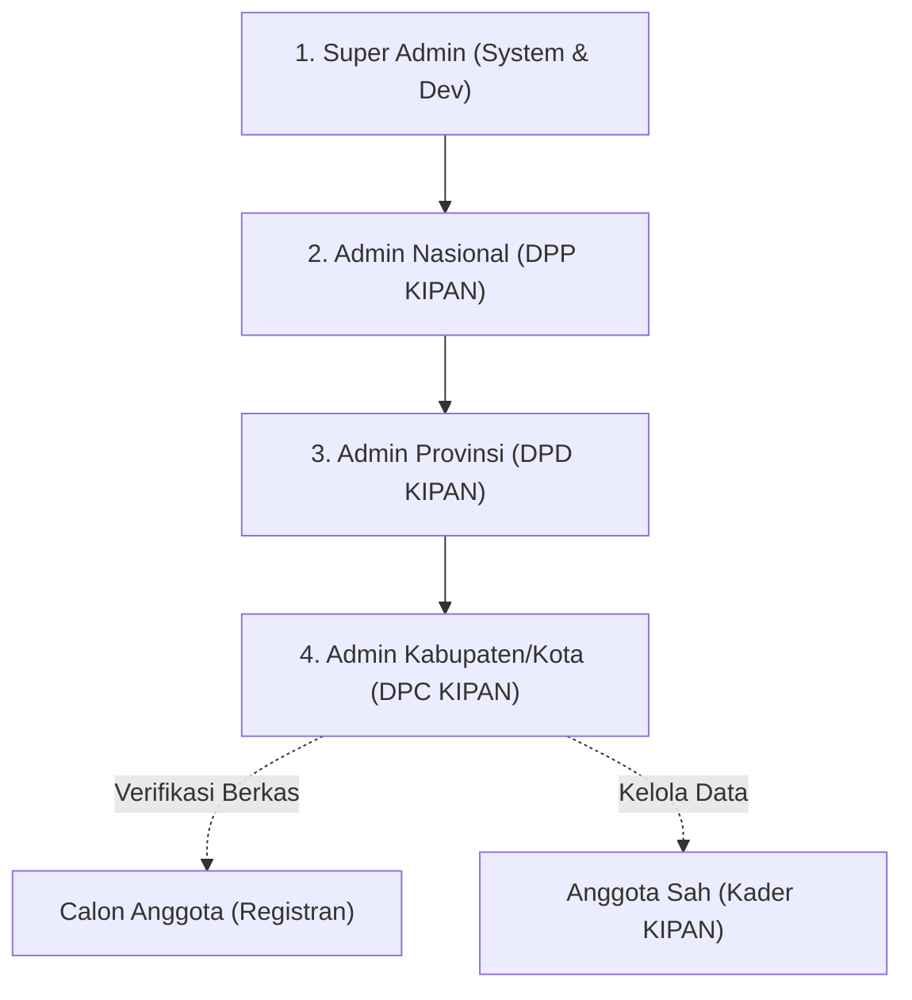
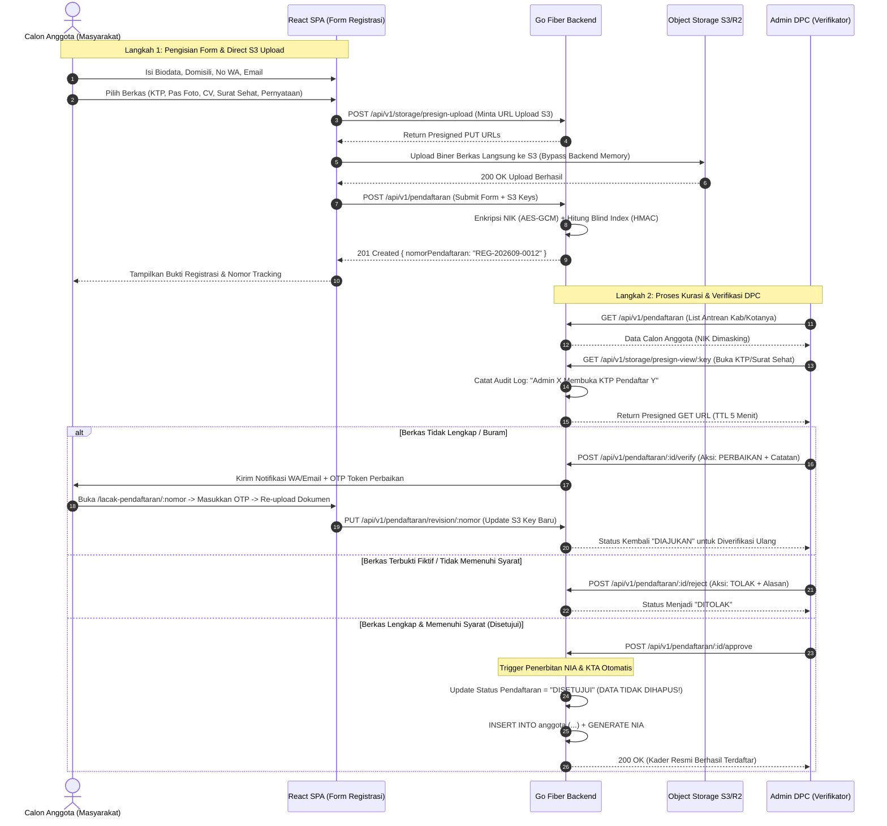
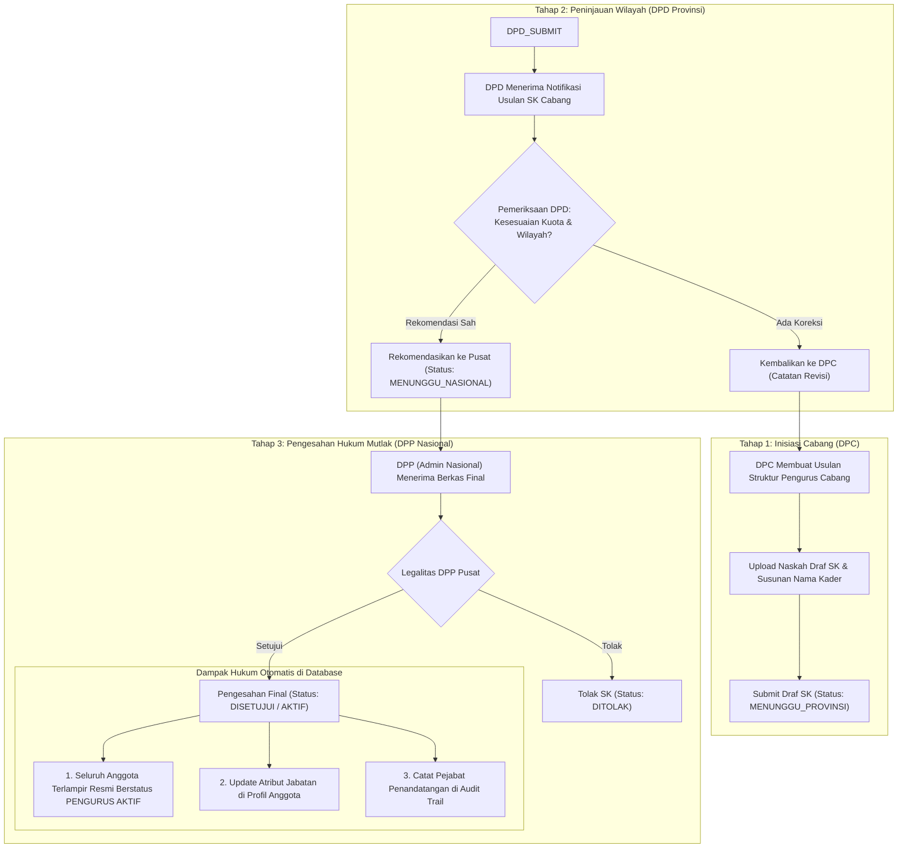

# 🏢 DOKUMEN SPESIFIKASI ALUR BISNIS & SISTEM CORE KIPAN INDONESIA
## Arsitektur Terpisah: Core Engine (Go Fiber + React SPA) & Portal CMS (Laravel)

> **Versi Dokumen**: 2.0.0 (Decoupled Core System)  
> **Ruang Lingkup**: **Core SIM-KIPAN** (Keanggotaan, Verifikasi Pendaftaran, Penerbitan NIA/KTA, Tata Kelola SK & Kepengurusan Berjenjang)  
> **Pemisahan Tanggung Jawab (Separation of Concerns)**:  
> - **Portal CMS & Landing Page**: Dioperasikan terpisah secara penuh menggunakan **Laravel** (Landing page profil organisasi, portal berita, galeri, agenda kerja, SEO & media publik).  
> - **Core Engine SIM-KIPAN**: Dioperasikan oleh **Golang (Go Fiber)** sebagai High-Security Transactional API dan **ReactJS SPA** sebagai Portal Pendaftaran Mandiri & Dashboard Internal Pengurus (DPP, DPD, DPC).

---

## DAFTAR ISI
1. [Pemisahan Batas Sistem (Core vs CMS Laravel)](#1-pemisahan-batas-sistem-core-vs-cms-laravel)
2. [Matriks Peran & Yurisdiksi Wilayah (RBAC Core)](#2-matriks-peran--yurisdiksi-wilayah-rbac-core)
3. [Alur Bisnis 1: Siklus Hidup Pendaftaran Calon Anggota](#3-alur-bisnis-1-siklus-hidup-pendaftaran-calon-anggota)
4. [Alur Bisnis 2: Penerbitan NIA, Legalitas KTA & Verifikasi Digital](#4-alur-bisnis-2-penerbitan-nia-legalitas-kta--verifikasi-digital)
5. [Alur Bisnis 3: Tata Kelola SK Berjenjang & Pengurus Daerah](#5-alur-bisnis-3-tata-kelola-sk-berjenjang--pengurus-daerah)
6. [Alur Bisnis 4: Manajemen Master Data & Audit Trail Non-Repudiasi](#6-alur-bisnis-4-manajemen-master-data--audit-trail-non-repudiasi)
7. [Titik Integrasi (Bridge) antara Core Golang dan CMS Laravel](#7-titik-integrasi-bridge-antara-core-golang-dan-cms-laravel)

---

## 1. PEMISAHAN BATAS SISTEM (CORE VS CMS LARAVEL)

Keputusan memisahkan CMS & Landing Page ke **Laravel** adalah langkah arsitektural yang sangat strategis. Hal ini mengisolasi lalu lintas publik (*traffic spikes*) dari data sensitif kependudukan (NIK, scan KTP).

```mermaid
graph TD
    subgraph PublicWorld ["Traffic Publik Luas (Internet)"]
        PUB_VISITOR["Masyarakat / Pembaca Berita"]
        REG_USER["Calon Anggota Baru (Pendaftar)"]
        VERIF_USER["Aparat / Publik (Scan QR KTA)"]
    end

    subgraph LaravelStack ["A. CMS & Landing Page (Full Laravel)"]
        LARAVEL_APP["Laravel App (Blade / Filament)"]
        LARAVEL_DB[(DB CMS / Konten)]
        LARAVEL_APP -->|Kelola Konten| LARAVEL_DB
    end

    subgraph CoreStack ["B. Core SIM-KIPAN (FOKUS UTAMA)"]
        REACT_SPA["ReactJS SPA<br/>(1. Portal Pendaftaran & Lacak Status)<br/>(2. Portal Admin Berjenjang DPC/DPD/DPP)"]
        GO_BACKEND["Go Fiber Core Engine<br/>(Auth JWT HttpOnly, RBAC, Presigned S3, KTA Engine)"]
        CORE_DB[(Core Database: PostgreSQL/MySQL<br/>Enkripsi NIK AES-256-GCM + Blind Index)]
        S3_STORAGE[(Private Object Storage S3/R2<br/>KTP, Berkas Sehat, SK, KTA PDF)]
        
        REACT_SPA -->|REST API v1| GO_BACKEND
        GO_BACKEND --> CORE_DB
        GO_BACKEND --> S3_STORAGE
    end

    PUB_VISITOR -->|Baca Profil, Berita, Galeri| LARAVEL_APP
    REG_USER -->|Daftar & Lacak Berkas| REACT_SPA
    VERIF_USER -->|Verifikasi Validitas KTA| GO_BACKEND
    LARAVEL_APP -.->|Read-Only Public API (Statistik Agregat)| GO_BACKEND
```

---

## 2. MATRIKS PERAN & YURISDIKSI WILAYAH (RBAC CORE)

Sistem Core SIM-KIPAN hanya melayani **4 Tingkat Pengguna Internal** dan **2 Pengguna Eksternal**:



### 2.1. Matriks Kewenangan Core System

| Fitur / Modul Core | Super Admin | Admin Nasional (DPP) | Admin Provinsi (DPD) | Admin Kab/Kota (DPC) | Calon Anggota / Publik |
|:---|:---:|:---:|:---:|:---:|:---:|
| **Yurisdiksi Akses Data** | Seluruh Sistem | Nasional (38 Prov, 514 Kab) | 1 Provinsi Terkait Saja | 1 Kab/Kota Terkait Saja | Data Milik Sendiri |
| **Pendaftaran Mandiri Online** | ❌ | ❌ | ❌ | ❌ | ✅ Form Pendaftaran |
| **Lacak Status Registrasi** | ❌ | ❌ | ❌ | ❌ | ✅ Nomor REG-XXXX |
| **Verifikasi Calon Anggota** | Full Override | Full Override | ❌ (Bukan Verifikator) | ✅ **Verifikator Utama** | ❌ |
| **Approval & Penerbitan NIA** | Full Override | Full Override | ❌ | ✅ **Penerbit Mandiri** | ❌ |
| **Akses Scan KTP / Dokumen** | ✅ (Audited) | ✅ (Audited) | ❌ | ✅ Hanya Saat Verifikasi | ❌ |
| **Drafting Draf SK Cabang** | ✅ Semua Level | ✅ Level Nasional/Prov | ✅ Level Provinsi | ✅ Level Kab/Kota | ❌ |
| **Review SK Tahap 1 (Provinsi)**| ✅ | ❌ | ✅ **Reviewer Wajib** | ❌ | ❌ |
| **Pengesahan Akhir SK (Hukum)**| ✅ Override | ✅ **Otoritas Tunggal Sah** | ❌ Dilarang | ❌ Dilarang | ❌ |
| **Demisioner Pengurus Cabang** | ✅ Override | ✅ Sah Melalui SK | ❌ | ❌ | ❌ |
| **Manajemen Akun Administrator**| ✅ Full CRUD | ❌ Dilarang | ❌ Dilarang | ❌ Dilarang | ❌ |
| **Audit Activity Log Forensik** | ✅ Full Akses | ❌ | ❌ | ❌ | ❌ |

---

## 3. ALUR BISNIS 1: SIKLUS HIDUP PENDAFTARAN CALON ANGGOTA

Alur pendaftaran kader KIPAN dirancang ketat untuk menjamin validitas identitas pemuda Indonesia bebas narkoba:



---

## 4. ALUR BISNIS 2: PENERBITAN NIA, LEGALITAS KTA & VERIFIKASI DIGITAL

### 4.1. Formula Standarisasi Nomor Induk Anggota (NIA)
Nomor Induk Anggota KIPAN bersifat unik nasional seumur hidup dengan aturan format:

$$\mathbf{KIPAN} - \mathbf{[KODE\_PROV]} - \mathbf{[KODE\_KAB]} - \mathbf{[TAHUN]} - \mathbf{[NO\_URUT]}$$

*Contoh*: **`KIPAN-JB-3204-2026-00012`**
- `JB`: Kode Wilayah Provinsi (Jawa Barat)
- `3204`: Kode Wilayah Kabupaten (Kab. Bandung)
- `2026`: Tahun pengangkatan menjadi anggota sah
- `00012`: Nomor urut kader terdaftar di kabupaten tersebut

### 4.2. Penerbitan KTA Server-Side & Verifikasi Anti-Pemalsuan
Untuk mematikan celah pemalsuan identitas (Issue 33):
1. **Server-Side Render**: KTA dicetak murni oleh mesin backend Go (menggunakan library grafik canvas atau PDF engine), bukan manipulasi DOM browser.
2. **Digital Signature QR Code**: 
   - Backend menghitung kode tanda tangan kriptografi:  
     $$\text{sig} = \text{HMAC-SHA256}(\text{NIA} + \text{TanggalAngkat}, \text{KTA\_SECRET\_KEY})$$
   - QR Code yang dicetak di belakang KTA memuat URL verifikasi resmi:  
     `https://kipan.id/v/KIPAN-JB-3204-2026-00012?sig=8f4b1...`
3. **Pemeriksaan Lapangan (Aparat Kepolisian / BNN / Publik)**:
   - Pemindaian QR Code membuka halaman verifikasi publik yang memanggil:  
     `GET /api/v1/public/verify-kta/KIPAN-JB-3204-2026-00012?sig=8f4b1...`
   - Backend memvalidasi signature HMAC. Jika valid, sistem menampilkan foto resmi dari server, nama lengkap, jabatan, dan status keaktifan sah. KTA palsu hasil editan Photoshop langsung terdeteksi **TIDAK VALID**.

---

## 5. ALUR BISNIS 3: TATA KELOLA SK BERJENJANG & PENGURUS DAERAH

Organisasi KIPAN beroperasi berdasarkan legalitas hukum Surat Keputusan. Tidak ada kepengurusan yang sah tanpa SK resmi DPP.



### 5.1. Alur Transisi Status Kepengurusan (Demisioner & Penggantian)
- **Masa Jabatan Berakhir**: Ketika tanggal berlaku SK terlewati atau diterbitkan SK Kepengurusan Baru untuk cabang bersangkutan, pengurus lama otomatis mengalami masa transisi status menjadi `Demisioner`.
- **Pemberhentian / Sanksi**: Admin Nasional berhak mencabut status pengurus tertentu (`Diberhentikan`) berdasarkan keputusan pleno etik, tanpa menghapus riwayat keanggotaan dasar kader yang bersangkutan.

---

## 6. ALUR BISNIS 4: MANAJEMEN MASTER DATA & AUDIT TRAIL NON-REPUDIASI

### 6.1. Pengamanan Master Data Wilayah (Anti-Hard Delete)
- **Masalah Lama (Masalah 27)**: Endpoint master wilayah membuka celah *hard-delete* yang merusak data puluhan ribu anggota relasional.
- **Aturan Bisnis Baru**:
  1. Master Data Provinsi (38) dan Kabupaten/Kota (514) bersifat **Immutable / Protected**.
  2. Dilarang melakukan *hard-delete* pada master wilayah.
  3. Penambahan pemekaran wilayah baru hanya dapat dilakukan oleh **Super Admin** atau **Admin Nasional**.

### 6.2. Prinsip Non-Repudiasi Audit Log
Setiap mutasi data sensitif di Core Engine wajib mencatat detail forensik ke tabel `activity_logs`:
- **Aktor Riil**: `actor_id`, `actor_name`, dan `actor_role` diambil dari sesi JWT terverifikasi (menghapus label statis `"Admin"` palsu).
- **Metadata Forensik**: Mencatat alamat IP publik pemanggil (`ip_address`) dan string `user_agent`.
- **Data Protection**: Isi metadata JSON mencatat perubahan nilai lama vs baru, namun atribut data pribadi sensitif (seperti nomor NIK utuh) **wajib disensor/dimasking** sebelum ditulis ke log.

---

## 7. TITIK INTEGRASI (BRIDGE) ANTARA CORE GOLANG DAN CMS LARAVEL

Meskipun sistem dipisahkan, terdapat 2 titik interaksi publik antara **Laravel CMS** dan **Go Core Engine**:

### 7.1. Endpoint Publik untuk Widget Statistik di Landing Page Laravel
Laravel membutuhkan data agregat ringkas untuk ditampilkan di widget beranda (contoh: *Jumlah Kader Aktif, Jumlah DPD Terbentuk, Jumlah DPC Aktif*):
- **Endpoint Go**: `GET /api/v1/public/stats/aggregate`
- **Karakteristik**:
  - Endpoint publik berkecepatan tinggi.
  - Di-cache menggunakan **Redis** dengan durasi 15–30 menit.
  - Hanya mengembalikan angka agregasi tanpa membuka data individu pendaftar.

### 7.2. Tautan Verifikasi KTA (QR Code Scanner)
- Ketika seseorang memindai QR Code pada fisik KTA, tautan mengarah ke domain verifikasi Core:  
  `https://kipan.id/v/:nia?sig=:signature`
- Halaman verifikasi dilayani oleh React SPA Core atau respons lightweight dari Go Engine, memastikan validitas dokumen hukum tidak bergantung pada database konten Laravel.

---

### Kesimpulan Alur Bisnis Core
Dengan pembagian ini:
1. **CMS & Portal Publik (Laravel)** bebas dipercantik, dirombak tampilannya, dan diisi konten harian oleh tim publikasi/humas tanpa risiko merusak database inti organisasi.
2. **Core System (Go Fiber + React SPA)** beroperasi mandiri, fokus 100% pada **keamanan data kader, validitas pendaftaran, legalitas SK, dan kecepatan penerbitan KTA nasional**.
